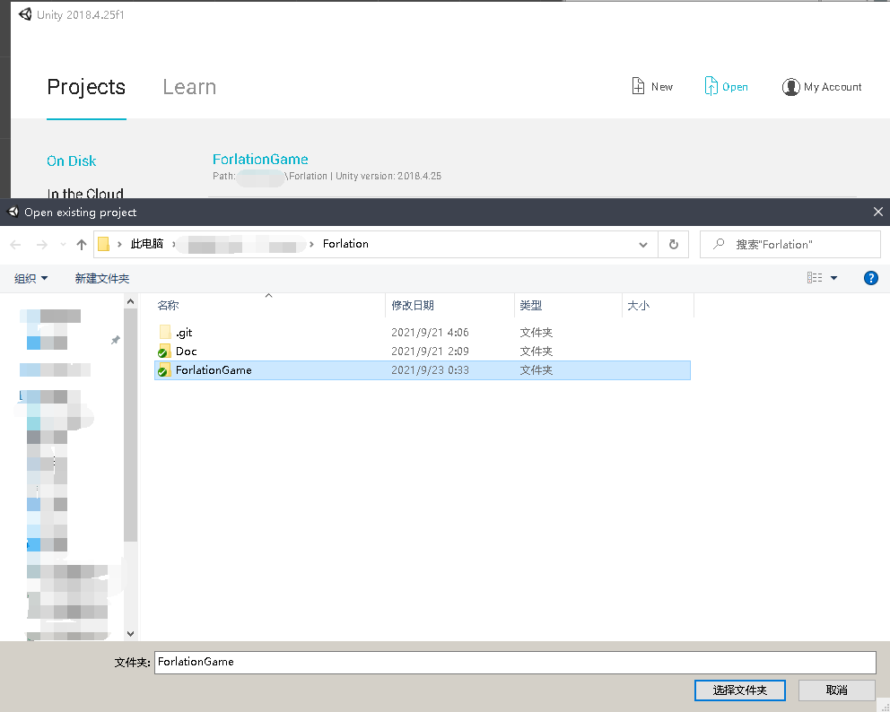
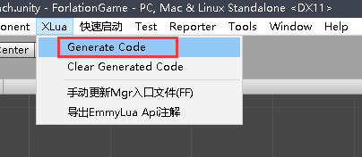
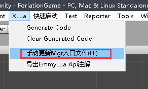
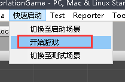
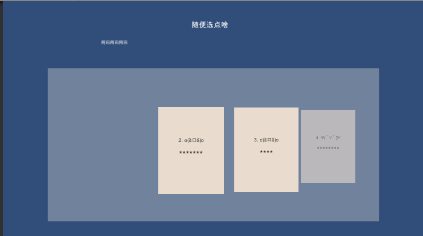

本篇将展示如何在**Unity编辑器**中快速运行起[Forlation](https://github.com/ltccss/Forlation)项目

这里我们假设您对Unity开发以及git的使用有略微的经验，许多基本操作诸如Unity的安装您可以通过官方文档自行去学习。

这里推荐您使用**Unity2018**的最新稳定版本，当然您也可以使用别的版本，但若有报错您可能需要自行解决或者提Issue

## 下载
您可以直接将[Forlation](https://github.com/ltccss/Forlation)仓库Clone到本地，或者下载zip包然后在本地解压出Forlation目录

## 打开项目
打开Unity，然后选择打开工程，定位到Forlation所在目录，选中其中ForlationGame目录，点击确定后打开这个工程，接下来便是等待Unity加载该工程，这可能需要一点时间

## 一些必要的文件生成

### C# Wrap文件生成
一般而言，使用lua时， 相比反射，更推荐您：预先将C#相关成员通过一层方法包装后注册进lua registry表中以供lua去调用，

当然，这些工作xLua本身就已经完成了，

我们只需要点击Unity菜单栏上的 "XLua" - "Generate Code" ，等待xLua生成对应的wrap文件就行了

(在该项目的git设置中，忽略了wrap文件的生成目录，您可以视实际情况将它纳入版本管理当中)

### 手动生成Mgr入口文件
在lua中使用单例并不是一件体验良好的事情，因此我们设计了一个全局静态入口类FF，将所有本应单例设计的模块管理类(Manager类)都挂到了FF的下面。

（事实上这种模式只是在访问便利性上作了权衡，单例的一大特色：惰性加载 并没有体现出来）

在编写代码的过程中，相关编辑器工具类会帮助检查是否有新的lua文件或者改动，并解析符合一定规则的lua文件，将其中对应的模块管理类写入FF文件中（您可以查阅 Assets/Editor/FF/FFEditor.cs 了解具体的机制）

理论上在项目首次被加载后会自动生成对应的FF文件，但为了安全起见，这里我们点击Unity菜单栏上的 "XLua" - "手动更新Mgr入口文件(FF)" 

## 运行
好了，准备工作就绪，接着就可以运行了。

您可以手动搜索名叫"GameLaunch"的场景并打开它，点击运行按钮，

当然，以上步骤也提供了更快捷的方式：

当运行后，您应该可以看到这样的画面：

##  一些额外的步骤
如果您使用VsCode开发，推荐您将Unity工程根目录，也即Forlation/ForlationGame目录整个拖入Vscode中，然后在VsCode设置中，将.meta文件排除（Files:Exclude项）

如果您使用EmmyLua插件， 可以试着点击菜单项"XLua" - "导出EmmyLua Api注解" 生成对应的Api注解以供编码使用