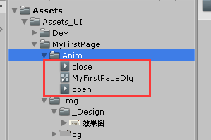

本篇将以一个具体的例子，介绍如何制作一个页面并在游戏中展示

这里我们假设您对Unity以及其配套的UGUI有一定的了解，并已经可以[快速运行起Forlation](../c1_launch_game/README.md)项目
（NGUI和FairyGui版本目前可能需要自行适配，这里暂时不展开细说）

## UI效果图
本次我们将制作的页面最终效果如下所示：


其中标题、具体描述、阿巴阿巴阿巴文本部分由程序动态设置

~~（*因为某些难以跨越的一像素难题，并不保证最终页面和效果图完全一致）~~

## 页面需求
1、点击右上角的“X”按钮可以关闭该页面

2、点击右下方的“阿巴阿巴阿巴”按钮可以切换左下方潦草小人的方向，并在小人朝左时“阿巴阿巴阿巴”按钮上显示“朝右看”的文本，在小人朝右时，按钮上显示“朝左看”的文本

3、标题和具体描述部分在代码里随意设置点新的文字内容

4、页面开启和关闭带一个渐入和渐出动效


## 准备一个新的Forlation工程
您需要在本地准备一个Forlation工程

详细步骤请参见[快速运行起Forlation](../c1_launch_game/README.md)

（准备完工程后您可以选择性删除其中的Doc目录和README.md文件）

## 导入需要的美术资源

您可以在[Art目录](../../Examples/c2_your_first_page/Art/)下找到原始的已经切好的图片


在Unity项目中的Assets/Assets_UI/目录下新建一个MyFirstPage目录


在MyFirstPage目录下再新建一个Img目录


将Art目录中的图片资源都拖入Img目录中


（您可以选择性给图片设置Tag或者在UGUI的新版图集模式下制作Atlas和编写相关逻辑以达到合批的目的，但这里将不展开细说）

## 准备测试场景

点击顶部菜单栏的 快速启动 - 切换至测试场景


当第一次打开测试场景时，编辑器会在本地创建一个被git忽略的空场景文件并打开它，

我们需要先在该场景中新建一个用于UGUI显示的结构：

在Hierarchy面板下，右键空白处，在弹出的菜单中选择UI - Canvas，创建一个Canvas节点


之后编辑器会在Hierarchy面板中生成Canvas和EventSystem节点，

点击Canvas节点，在其Inspector面板上参考下图红框部分修改这些设置：


## 制作UI

这里对于如何根据效果图拼出界面不作具体阐述，您可以直接下载[示例工程](../../Examples/c2_your_first_page) 查看最终生成的Prefab结构

总之，拼完后大致如下图所示：


## 生成Prefab

在Assets/Assets_UI/MyFirstPage目录下新建Prefab目录


将刚才制作完成的界面，从Hierarchy面板中拖入Prefab目录


拖完后，将在Prefab目录下看到名为MyFirstPageDlg的prefab


## 给Prefab添加UI脚本

在Hierarchy面板中，

点击MyFirstPageDlg节点，为其添加XLuaView脚本


选中如下图所示的节点


按ctrl + e， 再点击MyFirstPageDlg节点，在其Inspector面板上点击“粘贴”按钮，将这些节点引入XLiaView面板中


然后再保存下Prefab


## 编写页面对应的lua逻辑

在Assets/LuaScript/Game目录下新建MyFirstPage目录


右键MyFirstPage目录，在弹出的菜单中选择 Create - Lua(Dialog),


将生成的lua文件命名为MyFirstPageDlg(这里不需要添加lua文件名后缀)


双击打开MyFirstPageDlg这个lua文件（您可能需要先在系统中配置一下.lua后缀文件使用VsCode程序打开，然后在打开此文件之前，先将Assets目录整个拖入VsCode中）


首先实现下GetPrefabPath()方法

```
---@return string
function MyFirstPageDlg:GetPrefabPath()
    -- todo (prefab路径可以通过右键菜单 - Copy Path获取)
    return "Assets/Assets_UI/MyFirstPage/Prefab/MyFirstPageDlg.prefab"
end
```
其中返回的路径可以通过选中MyFirstPageDlg Prefab，然后通过右键菜单 - Copy Path获取


接着，导出一下emmylua的API注解,方便编写lua代码


编写初始化部分代码[视频](./code_write_init_part.mp4)

注：右上角的关闭按钮无需在代码中有任何处理，只要节点满足：A、命名"Sys_Close"， B、节点上有活跃的Button组件， C、节点被拖入XLuaView面板，即能实现点击关闭页面的逻辑

类似的还有Sys_Black，但这里将不展开细说，您可以在BaseDlg.lua中翻阅其实现


其他部分代码请参见[示例工程](../../Examples/c2_your_first_page/Forlation-main/ForlationGame/Assets/LuaScript/Game/MyFirstPage/MyFirstPageDlg.lua)

## Require该页面脚本

选中MyFirstPageDlg lua文件，在其Inspector面板上，点击Copy Require Path按钮


打开Assets/LuaScript/GameRequires.lua文件


在其末尾空白行，将刚才复制的文本粘贴进来


## 修改游戏初始逻辑

打开Assets/LuaScript/LuaGameManager.lua，

修改如下红框内部分：


将
```
DlgMgr.FetchDlg(TestDlg);
```

改为
```
DlgMgr.FetchDlg(MyFirstPageDlg);
```

## 启动游戏

点击顶部菜单栏中的 快速启动 - 开始游戏


然后就可以体验第一个界面了（还差了动效部分）


## 添加页面动效

最后，给页面添加一下淡入淡出动效

首先新建Assets/Assets_UI/MyFirstPage/Anim目录

给MyFirstPageDlg Prefab添加DiaAnim组件


添加时会自动额外添加Animator组件

按下ctrl + 6打开动画编辑面板

点击Create创建动画文件


保存位置为刚才新建的Assets/Assets_UI/MyFirstPage/Anim目录中

这里需要创建两个动画文件，对应打开页面和关闭页面时的动效

如下图所示，open和close即为创建的动画文件，MyFirstPageDlg.controller则为自动生成的动画控制器



创建完成后，继续在Animation面板（通过ctrl + 6打开）中，制作动效

制作过程这里不展开描述，请直接查看[示例工程](../../Examples/c2_your_first_page)

需要注意的是，在关闭动效中，需要添加一个事件帧，用以通知页面系统在动效播放到该事件帧时，真正地去关闭对应的页面，避免出现关闭动效尚未结束时页面就关闭的情况


接着双击MyFirstPageDlg，进入动画状态机设置


分别将open和close状态的名字改成UIAnim_Open和UIAnim_Close，这是DialogAnim组件上约定的动效开启和关闭状态名


再分别把动画文件的循环属性去除


最后，保存好Prefab的改动


您就可以再次点击快速启动-开始游戏，查看您的第一个界面了